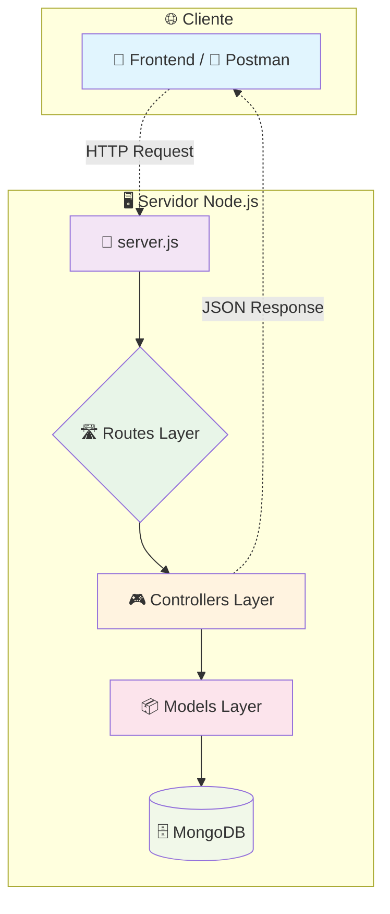

# 📚 Projeto Alura Criando uma API Rest com Express e MongoDB

<div align="center">

  **Estruturando o Conhecimento: Uma Arquitetura de API para o Mundo Literário**

  [](https://github.com/ESousa97/3266-express-mongo/actions/workflows/ci.yml)
  [](https://github.com/ESousa97/3266-express-mongo/actions/workflows/codeql.yml)
  [](https://codecov.io/gh/ESousa97/3266-express-mongo)
  [](https://github.com/ESousa97/3266-express-mongo)
  [](https://github.com/ESousa97/3266-express-mongo)
  [](https://github.com/ESousa97/3266-express-mongo)
  [](https://github.com/ESousa97/3266-express-mongo)

</div>

---

## 🎯 **Visão Geral**

> Uma API RESTful robusta e escalável desenvolvida em **Node.js** com **Express.js** e **MongoDB**, projetada para gerenciar uma livraria digital completa. Este projeto demonstra as melhores práticas de arquitetura backend, implementando padrões modernos de desenvolvimento e servindo como referência para sistemas de gerenciamento de conteúdo.

### 🌟 **Destaques Principais**

- 🏗️ **Arquitetura em Camadas** - Separação clara de responsabilidades
- 🔄 **API RESTful Completa** - Operações CRUD para Livros e Autores
- 🎯 **Busca Especializada** - Filtros avançados por editora
- 📊 **MongoDB + Mongoose** - Persistência robusta com validação
- 🚀 **Pronto para Produção** - Configuração para deploy e escalabilidade

---

## 📋 **Índice**

<details>
<summary>🔍 Clique para expandir</summary>

- [🎯 Visão Geral](#-visão-geral)
- [🔧 Tech Stack](#-tech-stack)
- [🏗️ Arquitetura do Sistema](#️-arquitetura-do-sistema)
- [✨ Funcionalidades](#-funcionalidades)
- [📁 Estrutura do Projeto](#-estrutura-do-projeto)
- [⚙️ Instalação e Configuração](#️-instalação-e-configuração)
- [🚀 Como Usar](#-como-usar)
- [📖 Documentação da API](#-documentação-da-api)
- [🧪 Testes](#-testes)
- [🌐 Deploy](#-deploy)
- [🤝 Contribuindo](#-contribuindo)
- [📄 Licença](#-licença)
- [👥 Equipe](#-equipe)

</details>

---

## 🔧 **Tech Stack**

<div align="center">

| Categoria | Tecnologia | Descrição |
|-----------|------------|-----------|
| **Runtime** |  | Plataforma JavaScript para backend |
| **Framework** |  | Framework web minimalista |
| **Database** |  | Banco de dados NoSQL |
| **ODM** |  | Modelagem de dados para MongoDB |
| **Dev Tools** |  | Auto-reload para desenvolvimento |

</div>

---

## 🏗️ **Arquitetura do Sistema**



### 🔄 **Fluxo de Dados**

1. **📡 Requisição** → Cliente envia requisição HTTP
2. **🛣️ Roteamento** → Express roteia para o controlador apropriado
3. **🎮 Processamento** → Controlador executa lógica de negócio
4. **📦 Persistência** → Modelo interage com MongoDB via Mongoose
5. **📤 Resposta** → Dados retornados em formato JSON

---

## ✨ **Funcionalidades**

<div align="center">

| 📚 **Livros** | 👨‍💼 **Autores** | 🔍 **Busca** |
|---------------|------------------|---------------|
| ✅ Criar livro | ✅ Criar autor | 🏢 Por editora |
| 📖 Listar todos | 👥 Listar todos | 🎯 Filtros avançados |
| 🔍 Buscar por ID | 🔍 Buscar por ID | 📊 Resultados paginados |
| ✏️ Atualizar dados | ✏️ Atualizar dados | - |
| 🗑️ Remover livro | 🗑️ Remover autor | - |

</div>

### 🎯 **Recursos Especiais**

- 🔗 **Relacionamento Autor-Livro** - Embedding otimizado para performance
- 🎛️ **Validação Automática** - Schemas Mongoose com validação
- 🌍 **Configuração Flexível** - Variáveis de ambiente para diferentes ambientes
- 📈 **Escalabilidade** - Arquitetura preparada para crescimento

---

## 📁 **Estrutura do Projeto**

```
📦 3266-express-mongo/
├── 📄 .gitignore
├── 📋 package.json
├── 🚀 server.js
├── 📁 src/
│   ├── 🎯 app.js
│   ├── ⚙️ config/
│   │   └── 🔌 dbConnect.js
│   ├── 🎮 controllers/
│   │   ├── 👨‍💼 autorController.js
│   │   └── 📚 livroController.js
│   ├── 📦 models/
│   │   ├── 👤 Autor.js
│   │   └── 📖 Livros.js
│   └── 🛣️ routes/
│       ├── 👥 autoresRoutes.js
│       ├── 🏠 index.js
│       └── 📚 livrosRoutes.js
└── 🔐 .env
```

---

## ⚙️ **Instalação e Configuração**

### 📋 **Pré-requisitos**

- 
- 
- 
- 

### 🚀 **Instalação Rápida**

```bash
# 1️⃣ Clone o repositório
git clone https://github.com/ESousa97/3266-express-mongo.git
cd 3266-express-mongo

# 2️⃣ Instale as dependências
npm install

# 3️⃣ Configure as variáveis de ambiente
cp .env.example .env
# Edite o arquivo .env com suas configurações

# 4️⃣ Inicie o servidor
npm run dev
```

### 🔧 **Configuração do Ambiente**

Crie um arquivo `.env` na raiz do projeto:

```env
# 🗄️ Configuração do Banco de Dados
DB_CONNECTION_STRING=mongodb+srv://<user>:<password>@<cluster>/<database>

# 🌐 Configuração do Servidor
PORT=3000
NODE_ENV=development

# 🔐 Configurações de Segurança (opcional)
JWT_SECRET=your_jwt_secret_here
```

---

## 🚀 **Como Usar**

### 📝 **Exemplo: Cadastrar Autor**

```bash
curl -X POST http://localhost:3000/autores \
  -H "Content-Type: application/json" \
  -d '{
    "nome": "Frank Herbert",
    "nacionalidade": "Americano"
  }'
```

### 📚 **Exemplo: Cadastrar Livro**

```bash
curl -X POST http://localhost:3000/livros \
  -H "Content-Type: application/json" \
  -d '{
    "titulo": "Duna",
    "editora": "Aleph",
    "preco": 89.90,
    "paginas": 680,
    "autor": "ObjectId_do_Autor_Aqui"
  }'
```

### 🔍 **Exemplo: Buscar por Editora**

```bash
curl "http://localhost:3000/livros/busca?editora=Aleph"
```

---

## 📖 **Documentação da API**

<details>
<summary>👨‍💼 <strong>Endpoints de Autores</strong></summary>

| Método | Endpoint | Descrição | Status |
|--------|----------|-----------|--------|
| `GET` | `/autores` | 📋 Lista todos os autores | ✅ |
| `GET` | `/autores/:id` | 🔍 Busca autor por ID | ✅ |
| `POST` | `/autores` | ➕ Cria novo autor | ✅ |
| `PUT` | `/autores/:id` | ✏️ Atualiza autor | ✅ |
| `DELETE` | `/autores/:id` | 🗑️ Remove autor | ✅ |

</details>

<details>
<summary>📚 <strong>Endpoints de Livros</strong></summary>

| Método | Endpoint | Descrição | Status |
|--------|----------|-----------|--------|
| `GET` | `/livros` | 📋 Lista todos os livros | ✅ |
| `GET` | `/livros/:id` | 🔍 Busca livro por ID | ✅ |
| `POST` | `/livros` | ➕ Cria novo livro | ✅ |
| `PUT` | `/livros/:id` | ✏️ Atualiza livro | ✅ |
| `DELETE` | `/livros/:id` | 🗑️ Remove livro | ✅ |
| `GET` | `/livros/busca?editora=X` | 🔍 Busca por editora | ✅ |

</details>

### 📊 **Códigos de Resposta**

| Código | Status | Descrição |
|--------|--------|-----------|
| `200` | ✅ OK | Requisição bem-sucedida |
| `201` | ➕ Created | Recurso criado com sucesso |
| `400` | ❌ Bad Request | Dados inválidos |
| `404` | 🔍 Not Found | Recurso não encontrado |
| `500` | 💥 Internal Error | Erro interno do servidor |

---

## 🧪 **Testes**

### 🔧 **Configuração de Testes**

```bash
# Instalar dependências de teste
npm install --save-dev jest supertest

# Executar testes
npm test

# Executar com cobertura
npm run test:coverage
```

### 📊 **Exemplo de Teste**

```javascript
// tests/livros.test.js
const request = require('supertest');
const app = require('../src/app');

describe('📚 Livros API', () => {
  test('✅ Deve listar todos os livros', async () => {
    const response = await request(app)
      .get('/livros')
      .expect(200);
    
    expect(response.body).toHaveProperty('livros');
  });
});
```

---

## 🌐 **Deploy**

### 🐳 **Docker**

```dockerfile
FROM node:16-alpine
WORKDIR /app
COPY package*.json ./
RUN npm ci --only=production
COPY . .
EXPOSE 3000
CMD ["npm", "start"]
```

### ☁️ **Plataformas Suportadas**

- 🟢 **Heroku** - Deploy automático via Git
- 🔵 **Vercel** - Serverless functions
- 🟠 **AWS EC2** - Instâncias dedicadas
- 🔴 **DigitalOcean** - Droplets otimizados

---

## 🤝 **Contribuindo**

Contribuições são muito bem-vindas! Siga estes passos:

```bash
# 1️⃣ Fork o projeto
# 2️⃣ Crie sua branch
git checkout -b feature/minha-feature

# 3️⃣ Commit suas mudanças
git commit -m "✨ Adiciona nova funcionalidade"

# 4️⃣ Push para a branch
git push origin feature/minha-feature

# 5️⃣ Abra um Pull Request
```

### 📋 **Diretrizes**

- ✅ Siga os padrões de código existentes
- 🧪 Adicione testes para novas funcionalidades
- 📝 Atualize a documentação quando necessário
- 🐛 Reporte bugs através das [Issues](https://github.com/ESousa97/3266-express-mongo/issues)

---

## ❓ **FAQ**

<details>
<summary><strong>🔌 Erro de conexão com MongoDB?</strong></summary>

Verifique:
- String de conexão no arquivo `.env`
- Permissões de IP no MongoDB Atlas
- Credenciais de usuário e senha

</details>

<details>
<summary><strong>📊 Por que dados do autor são duplicados?</strong></summary>

É uma decisão de modelagem (embedding) para otimizar operações de leitura, comum em bancos NoSQL.

</details>

<details>
<summary><strong>🚀 Como fazer deploy?</strong></summary>

O projeto é stateless e pode ser deployado em qualquer plataforma que suporte Node.js. Configure as variáveis de ambiente adequadamente.

</details>

---

## 📄 **Licença**

Este projeto está licenciado sob a **Licença ISC** - veja o arquivo [LICENSE](LICENSE) para detalhes.

---

## 👥 **Equipe**

<div align="center">

### 🏆 **Desenvolvedor Principal**


**José Enoque Sousa**

[](https://github.com/ESousa97)
[](https://www.linkedin.com/in/enoque-sousa-bb89aa168/)

</div>

---

## 📞 **Suporte**

<div align="center">

🐛 **Encontrou um bug?** [Abra uma Issue](https://github.com/ESousa97/3266-express-mongo/issues)

💡 **Tem uma sugestão?** [Inicie uma Discussion](https://github.com/ESousa97/3266-express-mongo/discussions)

📧 **Precisa de ajuda?** Entre em contato via LinkedIn

</div>

---

<div align="center">

**⭐ Se este projeto foi útil, deixe uma estrela!**

*Criado com ❤️ por [José Enoque Sousa](https://github.com/ESousa97)*

</div>


> ✨ **Criado em:** 9 de jun. de 2024 às 17:35
