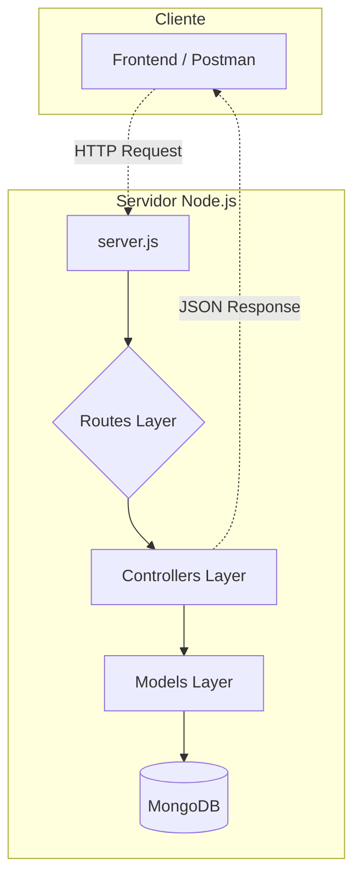

<div align="center">

# Alura Express + MongoDB

[](https://github.com/ESousa97/3266-express-mongo/actions/workflows/ci.yml)
[](https://github.com/ESousa97/3266-express-mongo/actions/workflows/codeql.yml)
[](https://www.codefactor.io/repository/github/esousa97/3266-express-mongo)
[](https://github.com/ESousa97/3266-express-mongo)
[](https://github.com/ESousa97/3266-express-mongo)
[](https://opensource.org/licenses/ISC)
[](#)

**API RESTful robusta e escalável desenvolvida em Node.js com Express.js e MongoDB, projetada para gerenciar uma livraria digital completa.**

</div>

---

> **⚠️ Projeto Arquivado**
> Este projeto não recebe mais atualizações ou correções. O código permanece disponível como referência e pode ser utilizado livremente sob a licença ISC. Fique à vontade para fazer fork caso deseje continuar o desenvolvimento.

---

## Índice

- [Sobre o Projeto](#sobre-o-projeto)
- [Destaques](#destaques)
- [Arquitetura](#arquitetura)
- [Funcionalidades](#funcionalidades)
- [Tecnologias](#tecnologias)
- [Começando](#começando)
  - [Pré-requisitos](#pré-requisitos)
  - [Instalação](#instalação)
  - [Configuração](#configuração)
  - [Uso Local](#uso-local)
- [Exemplos de Uso](#exemplos-de-uso)
- [Documentação da API](#documentação-da-api)
- [Scripts Disponíveis](#scripts-disponíveis)
- [Estrutura do Projeto](#estrutura-do-projeto)
- [Testes](#testes)
- [Deploy](#deploy)
- [FAQ](#faq)
- [Contribuição](#contribuição)
- [Licença](#licença)
- [Contato](#contato)

---

## Sobre o Projeto

Uma API RESTful completa desenvolvida em **Node.js** com **Express.js** e **MongoDB**, demonstrando as melhores práticas de arquitetura backend para gerenciamento de uma livraria digital. Este projeto serve como referência para sistemas de gerenciamento de conteúdo, implementando padrões modernos de desenvolvimento.

O sistema combina a robustez do Express com a flexibilidade do MongoDB, oferecendo uma solução escalável e performática para gerenciamento de livros e autores.

O repositório implementa:

- **Arquitetura em Camadas** — Separação clara de responsabilidades (Routes, Controllers, Models)
- **API RESTful Completa** — Operações CRUD para Livros e Autores
- **Busca Especializada** — Filtros avançados por editora
- **MongoDB + Mongoose** — Persistência robusta com validação de schemas
- **Pronto para Produção** — Configuração para deploy e escalabilidade

---

## Destaques

- **Arquitetura em Camadas** — Separação clara entre rotas, controladores e modelos
- **API RESTful** — Endpoints padronizados seguindo convenções HTTP
- **Busca Avançada** — Filtros especializados por editora
- **Validação Automática** — Schemas Mongoose com validação integrada
- **Relacionamento Autor-Livro** — Embedding otimizado para performance
- **Configuração Flexível** — Variáveis de ambiente para diferentes ambientes
- **Escalabilidade** — Arquitetura preparada para crescimento

---

## Arquitetura

### Arquitetura em Camadas



### Fluxo de Dados

1. **Requisição** → Cliente envia requisição HTTP
2. **Roteamento** → Express roteia para o controlador apropriado
3. **Processamento** → Controlador executa lógica de negócio
4. **Persistência** → Modelo interage com MongoDB via Mongoose
5. **Resposta** → Dados retornados em formato JSON

---

## Funcionalidades

### Gerenciamento de Livros

- Criar livro
- Listar todos os livros
- Buscar livro por ID
- Atualizar dados do livro
- Remover livro
- Buscar livros por editora

### Gerenciamento de Autores

- Criar autor
- Listar todos os autores
- Buscar autor por ID
- Atualizar dados do autor
- Remover autor

### Recursos Especiais

- **Relacionamento Autor-Livro** — Embedding otimizado para performance de leitura
- **Validação Automática** — Schemas Mongoose garantem integridade dos dados
- **Busca por Editora** — Endpoint especializado para filtrar livros
- **Configuração Flexível** — Suporte a diferentes ambientes via variáveis

---

## Tecnologias

### Core


### Ferramentas de Desenvolvimento


| Categoria | Tecnologia | Descrição |
|-----------|------------|-----------|
| **Runtime** | Node.js v16+ | Plataforma JavaScript para backend |
| **Framework** | Express.js | Framework web minimalista |
| **Database** | MongoDB | Banco de dados NoSQL |
| **ODM** | Mongoose | Modelagem de dados para MongoDB |
| **Dev Tools** | Nodemon | Auto-reload para desenvolvimento |

**Requisitos mínimos:**

- Node.js 16+ (recomendado)
- npm (latest)
- MongoDB (local ou cloud)
- Git (latest)

---

## Começando

### Pré-requisitos

```bash
node --version  # v16 ou superior
npm --version
```

### Instalação

1. **Clone o repositório**

```bash
git clone https://github.com/ESousa97/3266-express-mongo.git
cd 3266-express-mongo
```

2. **Instale as dependências**

```bash
npm install
```

### Configuração

Crie um arquivo `.env` na raiz do projeto:

```bash
cp .env.example .env
```

Configure as variáveis de ambiente:

```env
# Configuração do Banco de Dados
DB_CONNECTION_STRING=mongodb+srv://<user>:<password>@<cluster>/<database>

# Configuração do Servidor
PORT=3000
NODE_ENV=development

# Configurações de Segurança (opcional)
JWT_SECRET=your_jwt_secret_here
```

### Uso Local

**Subir o servidor de desenvolvimento:**

```bash
npm run dev
```

**Subir o servidor em produção:**

```bash
npm start
```

Acesse: `http://localhost:3000`

---

## Exemplos de Uso

### 1. Cadastrar Autor

```bash
curl -X POST http://localhost:3000/autores \
  -H "Content-Type: application/json" \
  -d '{
    "nome": "Frank Herbert",
    "nacionalidade": "Americano"
  }'
```

**Resposta:**
```json
{
  "_id": "507f1f77bcf86cd799439011",
  "nome": "Frank Herbert",
  "nacionalidade": "Americano"
}
```

### 2. Cadastrar Livro

```bash
curl -X POST http://localhost:3000/livros \
  -H "Content-Type: application/json" \
  -d '{
    "titulo": "Duna",
    "editora": "Aleph",
    "preco": 89.90,
    "paginas": 680,
    "autor": "507f1f77bcf86cd799439011"
  }'
```

### 3. Buscar Livros por Editora

```bash
curl "http://localhost:3000/livros/busca?editora=Aleph"
```

### 4. Listar Todos os Livros

```bash
curl http://localhost:3000/livros
```

### 5. Atualizar Livro

```bash
curl -X PUT http://localhost:3000/livros/507f1f77bcf86cd799439011 \
  -H "Content-Type: application/json" \
  -d '{
    "preco": 79.90
  }'
```

### 6. Deletar Livro

```bash
curl -X DELETE http://localhost:3000/livros/507f1f77bcf86cd799439011
```

---

## Documentação da API

### Endpoints de Autores

| Método | Endpoint | Descrição | Status |
|--------|----------|-----------|--------|
| `GET` | `/autores` | Lista todos os autores | `200 OK` |
| `GET` | `/autores/:id` | Busca autor por ID | `200 OK` |
| `POST` | `/autores` | Cria novo autor | `201 Created` |
| `PUT` | `/autores/:id` | Atualiza autor | `200 OK` |
| `DELETE` | `/autores/:id` | Remove autor | `200 OK` |

### Endpoints de Livros

| Método | Endpoint | Descrição | Status |
|--------|----------|-----------|--------|
| `GET` | `/livros` | Lista todos os livros | `200 OK` |
| `GET` | `/livros/:id` | Busca livro por ID | `200 OK` |
| `POST` | `/livros` | Cria novo livro | `201 Created` |
| `PUT` | `/livros/:id` | Atualiza livro | `200 OK` |
| `DELETE` | `/livros/:id` | Remove livro | `200 OK` |
| `GET` | `/livros/busca?editora=X` | Busca livros por editora | `200 OK` |

### Códigos de Resposta HTTP

| Código | Status | Descrição |
|--------|--------|-----------|
| `200` | OK | Requisição bem-sucedida |
| `201` | Created | Recurso criado com sucesso |
| `400` | Bad Request | Dados inválidos na requisição |
| `404` | Not Found | Recurso não encontrado |
| `500` | Internal Server Error | Erro interno do servidor |

---

## Scripts Disponíveis

```bash
# Iniciar servidor de desenvolvimento (com auto-reload)
npm run dev

# Iniciar servidor em produção
npm start

# Executar testes
npm test

# Executar testes com cobertura
npm run test:coverage

# Executar lint
npm run lint

# Formatar código automaticamente
npm run format
```

---

## Estrutura do Projeto

```
3266-express-mongo/
├── .github/
│   └── workflows/
│       ├── ci.yml              # Pipeline de CI
│       └── codeql.yml          # Análise de segurança
├── src/
│   ├── app.js                  # Configuração do Express
│   ├── config/
│   │   └── dbConnect.js        # Configuração de conexão MongoDB
│   ├── controllers/
│   │   ├── autorController.js  # Lógica de negócio - Autores
│   │   └── livroController.js  # Lógica de negócio - Livros
│   ├── models/
│   │   ├── Autor.js            # Schema Mongoose - Autor
│   │   └── Livros.js           # Schema Mongoose - Livro
│   └── routes/
│       ├── autoresRoutes.js    # Rotas de autores
│       ├── livrosRoutes.js     # Rotas de livros
│       └── index.js            # Agregador de rotas
├── .env                        # Variáveis de ambiente (não versionado)
├── .env.example                # Exemplo de variáveis de ambiente
├── .gitignore                  # Arquivos ignorados pelo Git
├── package.json                # Dependências e scripts
├── server.js                   # Entrypoint da aplicação
└── README.md                   # Este arquivo
```

---

## Testes

### Configuração de Testes

```bash
# Instalar dependências de teste
npm install --save-dev jest supertest

# Executar testes
npm test

# Executar com cobertura
npm run test:coverage
```

### Exemplo de Teste

```javascript
// tests/livros.test.js
const request = require('supertest');
const app = require('../src/app');

describe('Livros API', () => {
  test('Deve listar todos os livros', async () => {
    const response = await request(app)
      .get('/livros')
      .expect(200);
    
    expect(response.body).toHaveProperty('livros');
  });

  test('Deve criar um novo livro', async () => {
    const novoLivro = {
      titulo: "Duna",
      editora: "Aleph",
      preco: 89.90,
      paginas: 680
    };

    const response = await request(app)
      .post('/livros')
      .send(novoLivro)
      .expect(201);
    
    expect(response.body).toHaveProperty('_id');
  });
});
```

---

## Deploy

### Docker

```dockerfile
FROM node:16-alpine

WORKDIR /app

COPY package*.json ./
RUN npm ci --only=production

COPY . .

EXPOSE 3000

CMD ["npm", "start"]
```

### Docker Compose

```yaml
version: '3.8'

services:
  api:
    build: .
    ports:
      - "3000:3000"
    environment:
      - DB_CONNECTION_STRING=${DB_CONNECTION_STRING}
      - NODE_ENV=production
    depends_on:
      - mongodb

  mongodb:
    image: mongo:latest
    ports:
      - "27017:27017"
    volumes:
      - mongodb_data:/data/db

volumes:
  mongodb_data:
```

### Plataformas Suportadas

- **Heroku** — Deploy automático via Git
- **Vercel** — Serverless functions
- **AWS EC2** — Instâncias dedicadas
- **DigitalOcean** — Droplets otimizados
- **Railway** — Deploy simplificado
- **Render** — Deploy com zero configuração

---

## FAQ

### Erro de conexão com MongoDB?

Verifique:
- String de conexão no arquivo `.env`
- Permissões de IP no MongoDB Atlas
- Credenciais de usuário e senha corretas
- Conexão de rede (firewall/proxy)

### Por que dados do autor são duplicados no livro?

É uma decisão de modelagem (embedding) para otimizar operações de leitura, comum em bancos NoSQL como MongoDB. Isso evita joins e melhora a performance em queries frequentes.

### Como fazer deploy em produção?

O projeto é stateless e pode ser deployado em qualquer plataforma que suporte Node.js. Configure as variáveis de ambiente adequadamente e certifique-se de que a string de conexão do MongoDB está acessível.

### Como adicionar novos campos aos modelos?

Edite os schemas em `src/models/` e adicione as validações necessárias. O Mongoose cuidará automaticamente da validação.

---

## Contribuição

Contribuições são bem-vindas! Para contribuir:

1. **Fork o projeto**
2. **Crie uma branch para sua feature:**
   ```bash
   git checkout -b feature/minha-feature
   ```
3. **Commit suas mudanças:**
   ```bash
   git commit -m "Adiciona nova funcionalidade"
   ```
4. **Push para a branch:**
   ```bash
   git push origin feature/minha-feature
   ```
5. **Abra um Pull Request**

### Diretrizes

- Siga os padrões de código existentes
- Adicione testes para novas funcionalidades
- Atualize a documentação quando necessário
- Reporte bugs através das [Issues](https://github.com/ESousa97/3266-express-mongo/issues)

---

## Licença

Este projeto está sob a licença ISC. Veja o texto completo em [ISC License](https://opensource.org/licenses/ISC).

```
ISC License - você pode usar, copiar, modificar e distribuir este código.
```

---

## Contato

**José Enoque Costa de Sousa**

[](https://www.linkedin.com/in/enoque-sousa-bb89aa168/)
[](https://github.com/SousaDev97)
[](https://enoquesousa.vercel.app)

**Encontrou um bug?** [Abra uma Issue](https://github.com/ESousa97/3266-express-mongo/issues)  
**Tem uma sugestão?** [Inicie uma Discussion](https://github.com/ESousa97/3266-express-mongo/discussions)  
**Precisa de ajuda?** Entre em contato via LinkedIn

---

<div align="center">

**[⬆ Voltar ao topo](#alura-express--mongodb)**

Feito com ❤️ por [José Enoque](https://github.com/SousaDev97)

**Status do Projeto:** Archived — Sem novas atualizações

</div>
